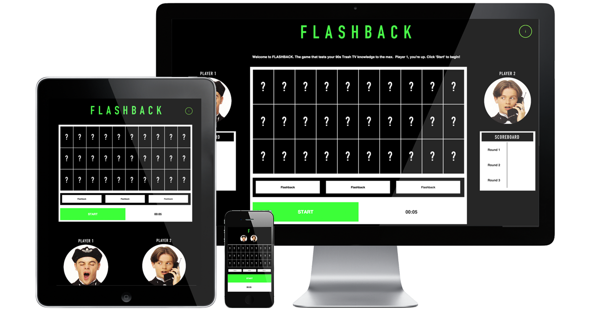
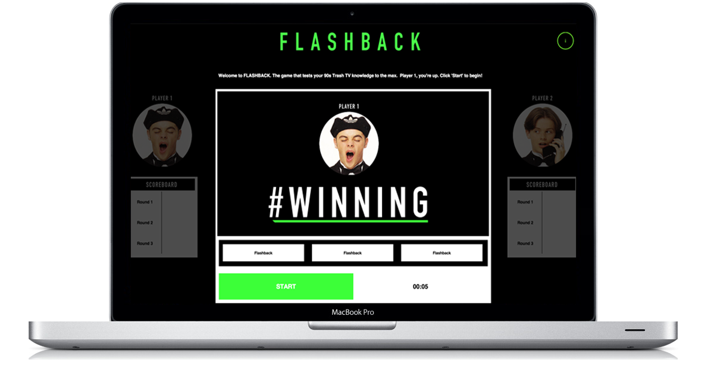
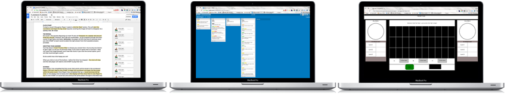

# FLASHBACK

### GA WDI16 London | Project 1

#### The game that tests your 90s trash TV knowledge to the max!

In FLASHBACK, we'll take you straight back to a time when a hash didn't have a tag and you couldn't change the channel without Ant and/or Dec hosting whatever show it was regardless of context (we're still not completely rid).

In this nostalgia-packed game, we've two players battling against the clock over 3 rounds, to correctly guess the hit show hidden beneath the squares. Sound easy? Think again. With every round the squares reveal less and less making a 'WIN' even harder. 

##### [Click here to play FLASHBACK now!](https://tv-flashback.herokuapp.com/ "Here!")

### How To Play

1. To start, click on the 'i' in the top right hand corner of the page to read a brief intro to the game
2. Player 1 starts the game and round 1, by clicking the START button
3. Once the START button is clicked, the clock will begin to countdown from 10, the squares will start to dissappear and you'll see three buttons, each with a possible answer on.
3. By the time the clock reaches 0, Player 1 will have to select their answer - by clicking on one of the 3 buttons
4. If they are correct, they'll 'WIN' that round and this will show in their scoreboard.
5. If they are incorrect, they'll 'LOSE' that round and this will show in their scoreboard.
6. Once Player 1 has played a round, it's now Player 2's turn (if you forget, you can always check the display at the top). Same with Player 1, Player 2 can begin their game by clicking on the START button - following the same process.
4. Play will continue until Player 2 finishes their game in Round 3 and the grand winner of FLASHBACK will be announced!

#### The Build

* HTML 5, CSS and jQuery were used to create this game.
* The information modal was created using external sheets.

#### Problems & Challenges

The most proilific challenage with this project was the timer and the way its behaviour impacted the rest of the game. In short, the nature of the timer is to countdown to ten with little else impacting it once it has been invoked. In this particular game, the click event that invoked the timer from the START button, also invoked the depletion of randomised squares, at various speeds [based on the round], populated the hidden image and assigned values - one of which was correct - to the innerHTML of the 3 buttons. In turn, upon interacting with the buttons - the timer was also impacted and like the squares required to reset. This is still rather 'buggy' in nature but is a V1 after all.

#### [for the] WIN

A significant win was the basis of my HTML and CSS. I spent a significant amount of time - keeping in mind the number of various divs on this page, in particular layered over each other - ensuring that I was engaging best practice in my positioning, to the best of my abilities/knowledge to date. This has previously been a well-oiled bad habit which I am slowly growing out of and feel confident that I can now adapt this relatively strong framework to become more mobile friendly in V2.

### Process

1. I started by writing out in full, the entire game process (IMG 1) - [View here](http://bit.ly/flashback-writeup "here") 
2. Using the write up, I went through and picked out every example where I would require building functionality 
3. Moving over to my Trello board - [view here](https://trello.com/b/6B9B0RCr/wdi16-project-1 "here") - I created tickets based on this functionality - using 'As a user I need to...' to ensure I focussed on the must have, should have, nice to haves - and then labeled them HTML/CSS, JS, etc. Finally I ordered them, and ice-boxed the 'Nice to have' tickets. (IMG 2)
4. Next - by hand for speed - I worked on wireframing and basic storyboarding (basic as a one pager)
5. Working through Trello and using my wireframe/storyboard, I was able to build a very basic HTML/CSS* skeleton from which to hang my initial JS functionality. (IMG 3) 
6. Once this was complete, I moved onto the JS working consistently until it was near to complete.
7. By this point, I was able to 'fill out' the HTML/CSS skeleton and create an identity for the game, ultimately completing the work. 

*Note. next time I would spend more time upfront working on the decorative aspects of the project as it become painful to witness such an unattractive product when consistently testing JS functionality. 
